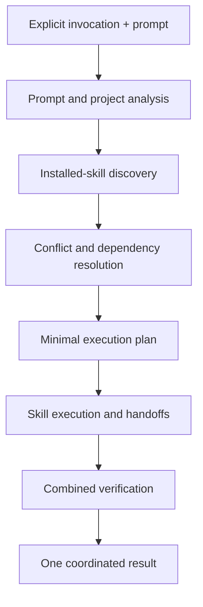

# CRUX Conductor

Explicitly orchestrate the minimum relevant installed skills for a prompt and project, resolve conflicts, coordinate structured handoffs, and verify one coherent result.

> **One prompt. The right skills. One coordinated result.**

## How it works

CRUX Conductor is the explicit entry point to the CRUX Skills ecosystem. The developer writes one prompt and does not need to know the catalog in advance. Conductor interprets the request, inspects relevant project signals, discovers installed skills, rejects unavailable provider guides, chooses the minimum sufficient compatible set, resolves ordering and conflicts, coordinates skill-to-skill handoffs, and verifies a single coherent result.

Conductor supports discovery-only, plan-before-execution, and coordinated-execution outcomes. Delegation may use isolated subagents when the host supports them; otherwise the same plan runs sequentially with structured handoffs in the current session. It is an orchestration and guidance layer, not a substitute for deterministic enforcement such as linters, tests, Git hooks, CI, or security scanners.

## Workflow diagram

## Invocation

This skill is **explicit-only**. Invoke it with `/crux-conductor` in Claude Code or the equivalent named-skill syntax exposed by the selected agent. It must not run automatically for ordinary prompts.

## Benefits

- Lets developers use one explicit command without knowing which installed skills match their request.
- Combines prompt intent with detected project context before selecting skills.
- Prevents unnecessary context loading by choosing the minimum sufficient compatible skill set.
- Coordinates skill-to-skill delegation through evidence-bearing structured handoffs.
- Detects conflicts and verifies the combined result instead of trusting isolated skill outputs.

## When to use

- Use when a developer explicitly invokes /crux-conductor or the equivalent command exposed by the current agent.
- Use for multi-domain development, architecture, security, implementation, testing, or review tasks that benefit from coordinated skills.
- Use in discovery mode to recommend relevant installed skills without executing the task.
- Invoke once at the start of a new coordinated task; follow-up prompts for the same active task reuse its plan unless the goal or constraints materially change.
- Do not use for ordinary prompts unless the developer explicitly invokes it.

## Compatibility

- Agents: codex, claude-code, copilot, cursor, gemini, generic
- Category: Orchestration
- Type: skill
- Status: required
- Required with CRUX Skills installs: true
- Invocation: explicit only
- Source: crux
- Version: 1.0.0
- License: MIT

## Permissions

| Capability | Requirement |
| --- | --- |
| Filesystem | read |
| Network | false |
| Scripts | false |
| Hooks | false |
| Authentication | false |

## Installation

CRUXIDE Skills Manager installs **CRUX Conductor** automatically whenever any CRUX Skills installation is confirmed. Choose the target agent and Project Local, Project Shared, or User scope. Manual installation copies this folder into the agent's supported skills directory.

## Project impact

CRUXIDE never adds application runtime dependencies automatically. Project Local installs are excluded from Git by default. External runtimes and caches stay outside the application project unless the developer explicitly chooses otherwise.

## Uninstall

Use **CRUXIDE: Manage Skills**, select the installed skill, and choose Uninstall. Review any project-authored changes before removal.

## Source

Developed by CRUX Team and distributed with CRUXIDE.

## Intellectual property ownership

The intellectual property rights in the **CRUX Conductor concept, orchestration design, and skill workflow** belong to [Eng. Mohamed Osama](https://www.linkedin.com/in/mohamedosama96/), Senior Android Engineer | Kotlin, Jetpack Compose. Distribution and use of the implementation remain subject to the repository license and any applicable written contributor or ownership agreements.
